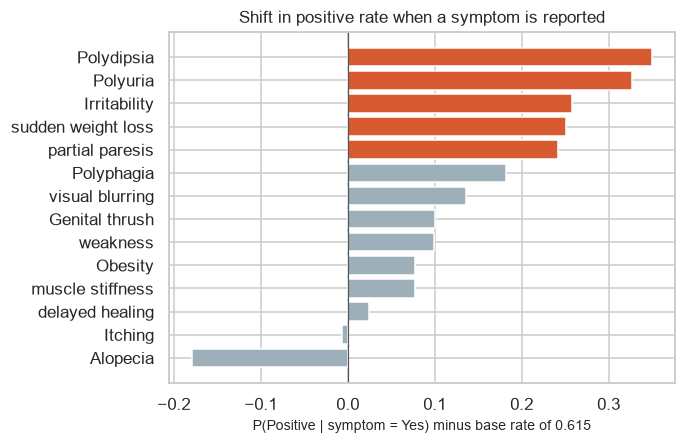
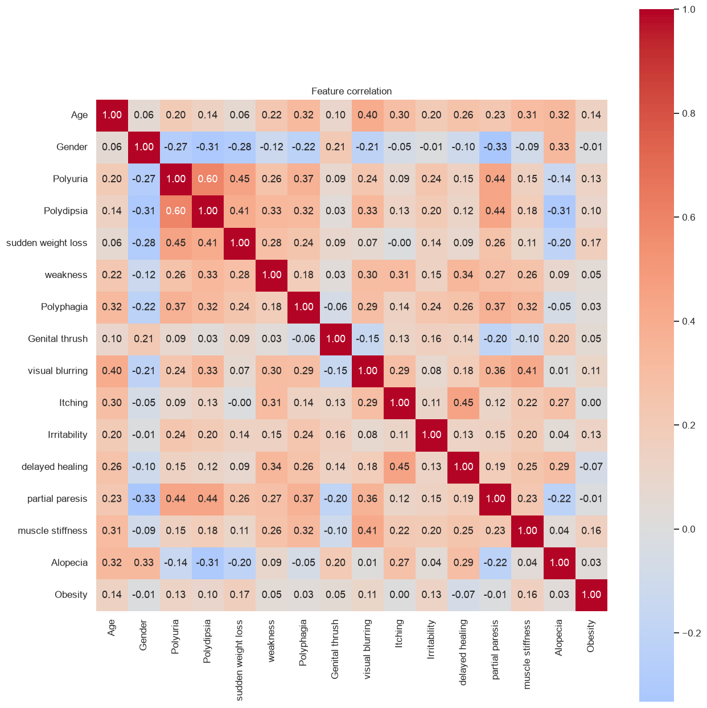
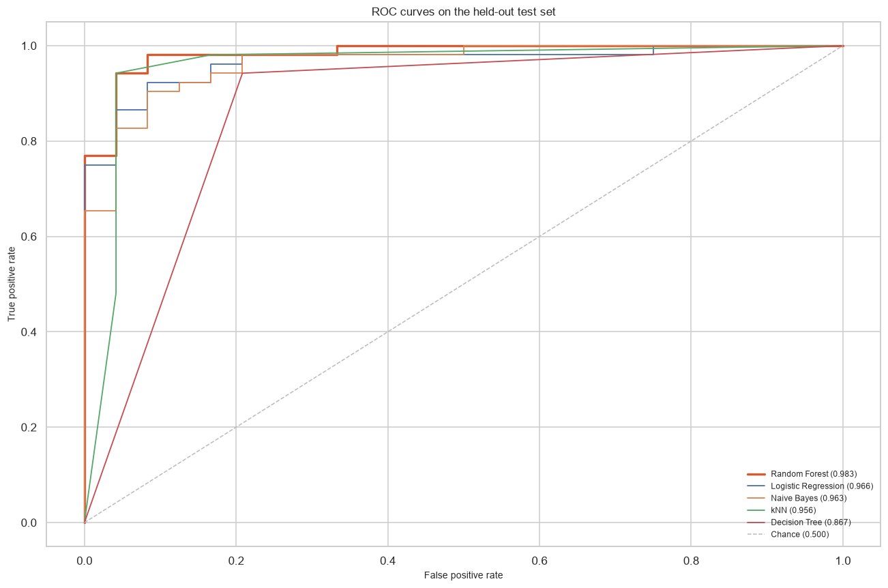
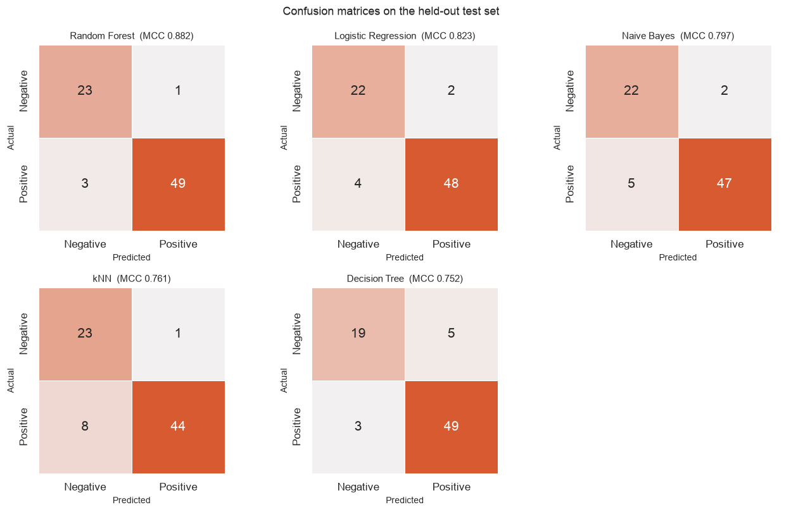
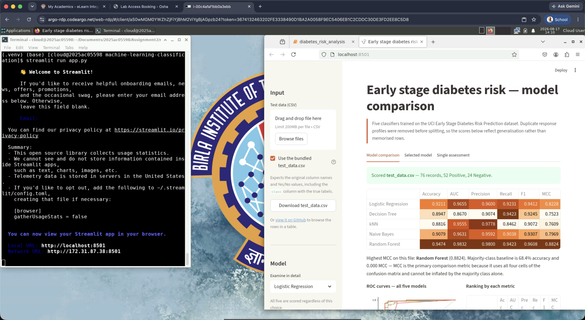

# Early Stage Diabetes Risk Prediction
```
Murlidhar Ravi Geetha Varma

BITS ID: [2025AC05598]

M.Tech (AIML) · Machine Learning · Assignment 2
```
5 classification models compared on the ```UCI Early Stage Diabetes Risk Prediction``` dataset, with an interactive Streamlit application for scoring uploaded test data.

---
## Table of Content

- [Problem statement](#problem-statement)
- [Dataset description](#dataset-description)
- [Links](#links)
  - [1. GitHub repository](#1-github-repository)
  - [2. Live Streamlit App](#2-live-streamlit-app)
- [Models used](#models-used)
  - [Comparison table](#comparison-table)
  - [Observations](#observations)
- [Streamlit application](#streamlit-application)
- [Running locally](#running-locally)
- [Reproducibility](#reproducibility)
- [BITS Lab Screenshot](#bits-lab-execution-screenshots)
---

## Problem statement

Predict whether an individual is at risk of early-stage diabetes from a short symptom questionnaire. This is a binary classification problem.

Diagnosing diabetes normally requires a blood test. A questionnaire that reliably flags likely cases from self-reported symptoms alone would let a clinic decide who to test first, which matters wherever laboratory capacity is limited. The question here is how accurately that judgement can be reproduced from sixteen questionnaire responses, and which family of model reproduces it best.

The two error types do not cost the same. A false negative is a missed case that receives no follow-up; a false positive is one unnecessary blood test. Recall and MCC are therefore weighted more heavily than raw accuracy in the observations below.

## Dataset description

**Source:** UCI Machine Learning Repository, dataset ID 529 - *Early Stage Diabetes Risk Prediction* <https://archive.ics.uci.edu/dataset/529/early+stage+diabetes+risk+prediction+dataset>

Collected by direct questionnaire from patients of Sylhet Diabetes Hospital, Sylhet, Bangladesh, and approved by a supervising physician. Licensed CC BY 4.0.

| Property | Value |
|---|---|
| Instances | 520 (assignment minimum: 500) |
| Features | 16 (assignment minimum: 12) |
| Target | `class` - Positive / Negative |
| Missing values | None |
| Class balance | 320 Positive (61.5%) / 200 Negative (38.5%) |

**Feature composition**

| Type | Count | Columns |
|---|---|---|
| Continuous | 1 | `Age` (16–90) |
| Binary, Male/Female | 1 | `Gender` |
| Binary, Yes/No | 14 | Polyuria, Polydipsia, sudden weight loss, weakness, Polyphagia, Genital thrush, visual blurring, Itching, Irritability, delayed healing, partial paresis, muscle stiffness, Alopecia, Obesity |





**Characteristics that shaped the analysis**

- **269 of the 520 records are exact duplicates**, leaving 251 distinct response profiles. No profile carries conflicting labels, so this is repetition rather than inconsistent labelling. A conventional `train_test_split` therefore places identical rows on both sides of the split, and a model that memorises a training row scores it correctly at test time without having generalised. **Every headline result below is computed after deduplication**; the conventional split is reported alongside as a contrast.
- **The majority-class baseline is 61.5% accuracy**, rising to **68.9% after deduplication**. Always predicting Positive attains that while scoring 0.000 MCC. Every accuracy figure is read against this floor, and MCC leads the comparison.
- **Two features nearly determine the outcome.** Reporting Polyuria raises the Positive rate to 0.94 and Polydipsia to 0.96, against a 0.615 base rate. Both are cardinal presenting symptoms of diabetes, so this is not target leakage - but it does mean high scores are the expected result for any correct implementation rather than evidence of a strong model.
- **Polyuria and Polydipsia correlate at 0.60**, the strongest of the 120 feature pairs and the only one above 0.5. This directly violates the conditional independence assumption of naive Bayes, a prediction made before fitting and checked against the results.
- **`Age` separates the classes weakly** (class means 49.1 vs 46.4) yet spans roughly 70× the numeric range of the 0/1 columns, so it is standardised for the distance-based and penalised models and left alone for the trees.

Full exploratory analysis in [`model/diabetes_risk_analysis.ipynb`](model/diabetes_risk_analysis.ipynb), section 1.

## Links 
### 1. GitHub repository

**Repository:** [`https://github.com/MurlidharVarma/machine-learning-classification.git`](https://github.com/MurlidharVarma/machine-learning-classification.git)

| Path | Purpose |
|---|---|
| `app.py` | Streamlit application |
| `requirements.txt` | Runtime dependencies, pinned |
| `test_data.csv` | Held-out test split, 76 labelled records |
| `data/` | Raw UCI download, 520 records |
| `src/` | Shared logic - config, data, models, metrics |
| `model/` | Training script, notebook, and five saved pipelines |

Every transformation is defined once in `src/` and imported by the training script, the notebook and the application alike, so the app cannot apply different preprocessing from the models it loads.

### 2. Live Streamlit App

**Streamlit App:** [`https://machine-learning-classification-2025ac05598.streamlit.app/`](https://machine-learning-classification-2025ac05598.streamlit.app/)

## Models used

All five models are trained on an identical stratified 70/30 split of the 251 distinct response profiles - 175 train, 76 test - with `random_state = 5598` throughout.

Each is wrapped in a scikit-learn `Pipeline`. This is a correctness requirement rather than a convenience: it keeps the scaler's mean and variance learned from training data only. Standardising before splitting would compute those statistics over the test set as well, producing an optimistic score with nothing in the code to indicate it.

| Model | Preprocessing | Reason |
|---|---|---|
| Logistic Regression | `StandardScaler` on `Age` | The L2 penalty shrinks coefficients by magnitude, so it penalises features evenly only on a shared scale |
| Decision Tree | none | Splits on a threshold within one feature; relative scale is irrelevant |
| kNN | `StandardScaler` on `Age` | Euclidean distance is otherwise dominated by the widest-ranging feature |
| Naive Bayes (Gaussian) | none | Fits a mean and variance per feature; linear rescaling changes nothing |
| Random Forest | none | As Decision Tree |

Only `Age` is scaled, via `ColumnTransformer`, with the 15 0/1 columns passed through. Standardising columns that are already binary would spread them into arbitrary ranges without changing any model's decisions.

Gaussian rather than Multinomial naive Bayes: `MultinomialNB` models count data, whereas `Age` is a continuous measurement whose magnitude would dominate the multinomial likelihood against 15 binary indicators. `BernoulliNB` would suit those indicators better still, but the assignment permits only Gaussian or Multinomial.

Logistic regression uses solver="liblinear". The scikit-learn documentation notes that "for small datasets, 'liblinear' is a good choice" and that it "can only handle binary classification by default" - both fit here, at 175 training rows with a binary target. It converges to the same coefficients as the lbfgs default while avoiding several warnings that make the training run unreadable.

### Comparison table

Held-out test set of 76 distinct profiles, none of which appears in training. AUC is computed from `predict_proba`, not from hard predictions. Precision, recall and F1 are with respect to the Positive class. The majority-class baseline on this file is **0.6842 accuracy and 0.000 MCC**.

| ML Model Name | Accuracy | AUC Score| Precision | Recall | F1 Score| MCC Score|
|---|---|---|---|---|---|---|
| Logistic Regression | 0.9211 | 0.9655 | 0.9600 | 0.9231 | 0.9412 | 0.8228 |
| Decision Tree | 0.8947 | 0.8670 | 0.9074 | 0.9423 | 0.9245 | 0.7523 |
| kNN | 0.8816 | 0.9555 | 0.9778 | 0.8462 | 0.9072 | 0.7609 |
| Naive Bayes | 0.9079 | 0.9631 | 0.9592 | 0.9038 | 0.9307 | 0.7969 |
| **Random Forest (Ensemble)** | **0.9474** | **0.9832** | **0.9800** | **0.9423** | **0.9608** | **0.8824** |

Random Forest is best or joint-best on all 6 metrics - outright on 5, tying the Decision Tree on recall at 0.9423.

#### ROC Curve


#### Confusion Matrix

### Observations

Every figure quoted below is printed by [`model/diabetes_risk_analysis.ipynb`](model/diabetes_risk_analysis.ipynb) or by [`model/train.py`](model/train.py).

| ML Model Name | Observation about model performance |
|---|---|
| **Logistic Regression** | The best of the four non-ensemble models: 0.9211 accuracy and 0.8228 MCC, with an AUC of 0.9655 that is second only to the Random Forest. On the 76 test records it misses 4 positive cases and produces 2 false positives, so its errors are fairly balanced between the two directions. One caution about reading it: the model gives every feature a weight, and it is tempting to treat the biggest weights as the most important symptoms. That does not hold here, because Polyuria and Polydipsia have a correlation of 0.60 and therefore carry much of the same information. When two features overlap that heavily, the weight the model assigns to each one individually is not a reliable ranking of which symptom matters more. |
| **Decision Tree** | 0.8947 accuracy and 0.7523 MCC, the lowest MCC of the five. Its most distinctive result is the relationship between two of its own scores: at 0.8670 its AUC is *below* its accuracy, and it is the only model of the five where that happens, for every other model the AUC is the higher number. Accuracy asks whether each yes/no answer was right; AUC asks whether the model can rank patients by how likely they are to be positive. The tree answers the first question competently and the second one poorly. It also produces the most false positives of any model, 5 against a best of 1. It needs no feature scaling, since each split compares one feature against a threshold rather than comparing features to each other. |
| **kNN** | The lowest accuracy of the five at 0.8816, with 0.7609 MCC. The confusion matrices explain why in a way the headline numbers do not: it produces only 1 false positive, the joint-fewest, but misses 8 positive cases, the most of any model, and makes 9 errors in total, also the most. For a screening tool that is the wrong direction to fail in, a missed case gets no follow-up, while a false positive costs one blood test. It is also the model most exposed to feature scaling. It classifies a patient by finding the most similar patients in the training data, and `Age` ranges from 16 to 90 while the other 15 features are 0 or 1, so without scaling that one column would dominate every similarity calculation. It is given a `StandardScaler` for exactly that reason. |
| **Naive Bayes** | 0.9079 accuracy and 0.7969 MCC, which is better than its central assumption would suggest. The model assumes that, once you know whether a patient is positive, each symptom is independent of the others. That is not true here: Polyuria and Polydipsia correlate at 0.60, the strongest pair in the data, so the model treats one shared signal as two separate pieces of evidence and effectively counts it twice. This was visible in the exploratory analysis before any model was fitted. Despite it, its AUC of 0.9631 is almost identical to Logistic Regression's 0.9655, so its ability to rank patients is barely affected. |
| **Random Forest (Ensemble)** | The strongest model, best or joint-best on all 6 metrics: 0.9474 accuracy, 0.9832 AUC, 0.8824 MCC, winning 5 outright and tying the Decision Tree on recall at 0.9423. It also makes the fewest errors of any model - 4 out of 76 records, against 6 for the next best - with only 3 missed cases and 1 false positive. It is built from many decision trees rather than one, and it improves on the single tree everywhere that matters here, converting the weakest AUC of the five into the strongest. |
| **Overall winner for your dataset?** | **Random Forest.** It is best or joint-best on every one of the 6 metrics and makes the fewest total errors, so the conclusion does not depend on which metric is treated as most important. Two qualifications belong with it. First, duplicate response profiles were removed before the data was split, so no test patient also appeared in training and these scores measure genuine generalisation. Second, the task is easier than the numbers suggest: 96.6% of patients reporting Polydipsia and 94.2% reporting Polyuria are positive, against a base rate of 61.5%, so 2 of the 16 features come close to restating the diagnosis. Logistic Regression remains the more practical choice where the reasoning has to be explained to a clinician, since a single set of feature weights is far easier to communicate than a forest of trees. |

**On the absolute numbers.** Every model clears the 0.6842 majority-class baseline by a wide margin. That says more about the dataset than about the modelling: two symptom features are close to restatements of the diagnosis. A high score here is the expected result for any correctly implemented classifier, not evidence of an unusually good one - which is why the comparison leads with MCC rather than accuracy, and why duplicate records were removed before the split.

## Streamlit application

The app loads the 5 pretrained pipelines and scores them against an uploaded CSV. It does not train on startup: fitting 5 models per page load would report different numbers from this README.

| Required feature | Where it is |
|---|---|
| **a.** Dataset upload (CSV, test data only) | Sidebar uploader; `test_data.csv` in the repository root is a ready-made input, and a checkbox loads it directly |
| **b.** Model selection dropdown | Sidebar selector across all five models |
| **c.** Display of evaluation metrics | Six metric tiles for the selected model, plus a comparison table scoring **all five** on the uploaded file |
| **d.** Confusion matrix / classification report | Both, for the selected model |

Three tabs: **Model comparison** (all 5 scored on the uploaded file, with a ROC overlay and a per-metric ranking), **Selected model** (the 6 metrics, a confusion matrix, a classification report, and a decision-threshold slider showing the precision/recall trade-off), and **Single assessment** (enter one questionnaire and get a risk probability).

**Streamlit App:** [`https://machine-learning-classification-2025ac05598.streamlit.app/`](https://machine-learning-classification-2025ac05598.streamlit.app/)


## Running locally

```bash
python3.12 -m venv .venv
source .venv/bin/activate
pip install -r requirements-dev.txt      # or requirements.txt for the app alone

python model/train.py                    # trains, evaluates, writes model/ and test_data.csv
streamlit run app.py                     # the application
jupyter lab                              # model/diabetes_risk_analysis.ipynb
```

## Reproducibility

- `SEED = 5598`, defined once in `src/config.py` and used for every split and every model.
- Trained on **Python 3.12.12** with **scikit-learn 1.7.2**. Both are pinned in `requirements.txt`, because the saved `.joblib` pipelines record class references by import path and can fail to load against a mismatched version.
- `model/metadata.json` records the versions, seed, split sizes and metrics of the run that produced the committed model files.
- `model/train.py` runs the whole analysis end to end from a clean interpreter; the notebook runs top to bottom from a fresh kernel and is committed with outputs intact.

## BITS Lab Execution Screenshots


